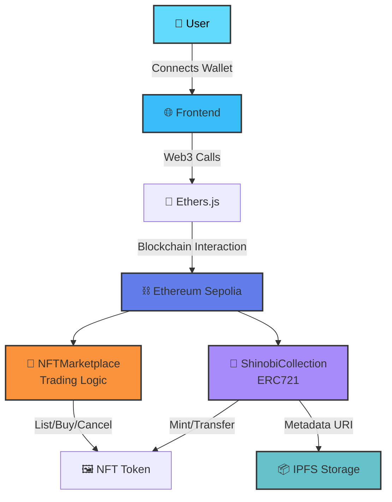
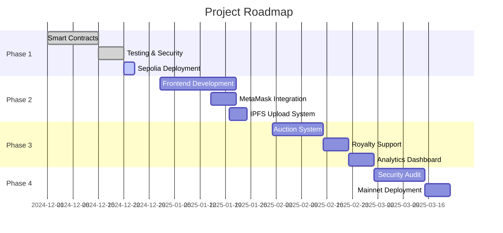

<div align="center">

# 🎴 Shinobi NFT Marketplace

### *A decentralized NFT marketplace built on Ethereum*

[](https://soliditylang.org/)
[](https://hardhat.org/)
[](https://openzeppelin.com/)
[](https://ethereum.org/)


[🚀 Live Demo](#) • [📖 Documentation](#) • [🐛 Report Bug](https://github.com/yourusername/shinobi-nft-marketplace/issues) • [✨ Request Feature](https://github.com/yourusername/shinobi-nft-marketplace/issues)

</div>

---

<div align="center">

## 🎯 About This Project

</div>

I'm a **second-year Computer Science student** passionate about **Web3 and blockchain technology**. As someone who loves building decentralized applications, I created this NFT marketplace to combine my skills in smart contract development with real-world use cases.

> *"The best way to understand code is to share it with the world. As an active builder, I've found that shipping products teaches more than any tutorial ever could."*

This project represents my journey into **decentralized finance and NFTs** — built from scratch with security, scalability, and user experience in mind.

---

<div align="center">

## 🛠️ Tech Stack I Used

</div>

<div align="center">

### **Blockchain & Smart Contracts**
<p>


</p>

### **Development & Testing**
<p>


</p>

### **Frontend (Coming Soon)**
<p>


</p>

### **Deployment & Infrastructure**
<p>


</p>

</div>

---

<div align="center">

## ⚡ Features

</div>

<table>
<tr>
<td width="50%">

### 🎨 NFT Collection
- ✅ **Mint Shinobi NFTs** with custom metadata
- ✅ **ERC721 Standard** compliance
- ✅ **IPFS Integration** for decentralized storage
- ✅ **Real-time supply tracking**
- ✅ **OpenSea compatible**

</td>
<td width="50%">

### 🏪 Marketplace
- ✅ **List NFTs** with custom pricing
- ✅ **Buy instantly** with ETH
- ✅ **Cancel listings** anytime
- ✅ **Update prices** dynamically
- ✅ **ReentrancyGuard** protection

</td>
</tr>
</table>

---

<div align="center">

## 🏗️ System Architecture

</div>


---

<div align="center">

## 🚀 Quick Start

</div>

### Prerequisites
```bash
node --version  # v18.0.0 or higher
npm --version   # v9.0.0 or higher
```

You'll also need:
- 🦊 [MetaMask](https://metamask.io/) wallet
- 💧 [Sepolia testnet ETH](https://sepoliafaucet.com/)
- 🔑 [Alchemy API Key](https://www.alchemy.com/)

### Installation
```bash
# Clone the repository
git clone https://github.com/yourusername/shinobi-nft-marketplace.git
cd shinobi-nft-marketplace

# Install dependencies
npm install

# Create environment file
cp .env.example .env
```

### Environment Setup

Create a `.env` file:
```env
SEPOLIA_RPC_URL=https://eth-sepolia.g.alchemy.com/v2/YOUR_API_KEY
PRIVATE_KEY=your_wallet_private_key_here
ETHERSCAN_API_KEY=your_etherscan_api_key
```

⚠️ **Never commit your `.env` file!**

---

<div align="center">

## 🧪 Testing

</div>
```bash
# Compile contracts
npx hardhat compile

# Run all tests
npx hardhat test

# Run with gas reporting
REPORT_GAS=true npx hardhat test

# Generate coverage report
npx hardhat coverage
```

### Test Results
```
  ShinobiCollection
    ✔ Should mint a new Shinobi NFT (142ms)
    ✔ Should track total minted (87ms)
    ✔ Should set correct token URI (95ms)

  NFTMarketplace
    ✔ Should list an NFT for sale (168ms)
    ✔ Should buy a listed NFT (243ms)
    ✔ Should cancel a listing (121ms)
    ✔ Should update listing price (134ms)
    ✔ Should prevent unauthorized actions (156ms)
    ✔ Should handle reentrancy attacks (289ms)

  9 passing (1.8s)
```

---

<div align="center">

## 📦 Deployment

</div>

### Deploy to Sepolia Testnet
```bash
# Deploy NFT Collection
npx hardhat run scripts/deploy-collection.js --network sepolia

# Deploy Marketplace
npx hardhat run scripts/deploy-marketplace.js --network sepolia

# Verify on Etherscan
npx hardhat verify --network sepolia <CONTRACT_ADDRESS>
```

### Deployed Contracts

| Contract | Address | Explorer |
|----------|---------|----------|
| ShinobiCollection | `0x...` | [View on Etherscan](#) |
| NFTMarketplace | `0x...` | [View on Etherscan](#) |

---

<div align="center">

## 📝 Smart Contract Functions

</div>

### ShinobiCollection.sol
```solidity
// Mint a new Shinobi NFT
function mintShinobi(address recipient, string memory tokenURI) 
    public returns (uint256)

// Get total number of minted NFTs
function totalMinted() public view returns (uint256)
```

### NFTMarketplace.sol
```solidity
// List an NFT for sale
function listItem(address nft, uint256 tokenId, uint256 price) 
    external

// Purchase a listed NFT
function buyItem(address nft, uint256 tokenId) 
    external payable

// Remove NFT from marketplace
function cancelListing(address nft, uint256 tokenId) 
    external

// Update listing price
function updatePrice(address nft, uint256 tokenId, uint256 newPrice) 
    external
```

---

<div align="center">

## 🔐 Security Features

</div>

<table>
<tr>
<td align="center" width="25%">

<br/><b>ReentrancyGuard</b>
<br/>Prevents reentrancy attacks
</td>
<td align="center" width="25%">

<br/><b>Ownership Checks</b>
<br/>Only owners can list NFTs
</td>
<td align="center" width="25%">

<br/><b>Approval System</b>
<br/>Secure transfer permissions
</td>
<td align="center" width="25%">

<br/><b>OpenZeppelin</b>
<br/>Battle-tested libraries
</td>
</tr>
</table>

---

<div align="center">

## 📊 GitHub Stats

</div>

<div align="center">


</div>

---

<div align="center">

## 🗺️ Roadmap

</div>


**Current Status:** ✅ Phase 1 Complete

- [x] ✅ Smart contract development
- [x] ✅ Comprehensive testing
- [x] ✅ Sepolia testnet deployment
- [ ] ⏳ Frontend interface
- [ ] 📅 IPFS integration
- [ ] 📅 Mainnet launch

---

<div align="center">

## 💡 What I Learned

</div>

Building this project taught me:

- 🎯 **Smart Contract Security** - Implementing reentrancy guards and secure payment handling
- 🔄 **ERC Standards** - Deep understanding of ERC721 and marketplace patterns
- 🧪 **Testing Best Practices** - Writing comprehensive unit tests with Hardhat
- 📦 **Gas Optimization** - Minimizing transaction costs through efficient code
- 🌐 **Web3 Integration** - Connecting blockchain with frontend applications
- 🔐 **Decentralized Storage** - Using IPFS for NFT metadata

---

<div align="center">

## 🤝 Contributing

</div>

Contributions make the open-source community amazing! Any contributions you make are **greatly appreciated**.

1. Fork the Project
2. Create your Feature Branch (`git checkout -b feature/AmazingFeature`)
3. Commit your Changes (`git commit -m 'Add some AmazingFeature'`)
4. Push to the Branch (`git push origin feature/AmazingFeature`)
5. Open a Pull Request

---

<div align="center">

## 📫 Connect With Me

</div>

<div align="center">

[](https://github.com/yourusername)
[](https://linkedin.com/in/yourprofile)
[](https://twitter.com/yourhandle)
[](mailto:your.email@example.com)

</div>

---

<div align="center">

## 📄 License

</div>

This project is licensed under the MIT License - see the [LICENSE](LICENSE) file for details.

---

<div align="center">

## 🙏 Acknowledgments

</div>

- [OpenZeppelin](https://openzeppelin.com/) - Secure smart contract development
- [Hardhat](https://hardhat.org/) - Ethereum development environment
- [Ethers.js](https://docs.ethers.org/) - Complete Ethereum library
- [Alchemy](https://www.alchemy.com/) - Blockchain infrastructure
- [IPFS](https://ipfs.io/) - Decentralized storage protocol

---

<div align="center">

### ⭐ If you found this project helpful, please give it a star!


**Made with ❤️ and ☕ by [Your Name]**


</div>
